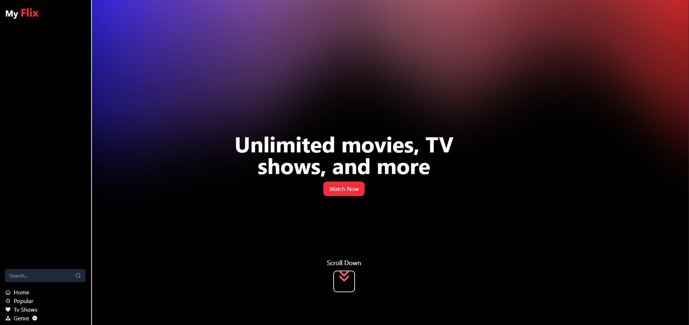
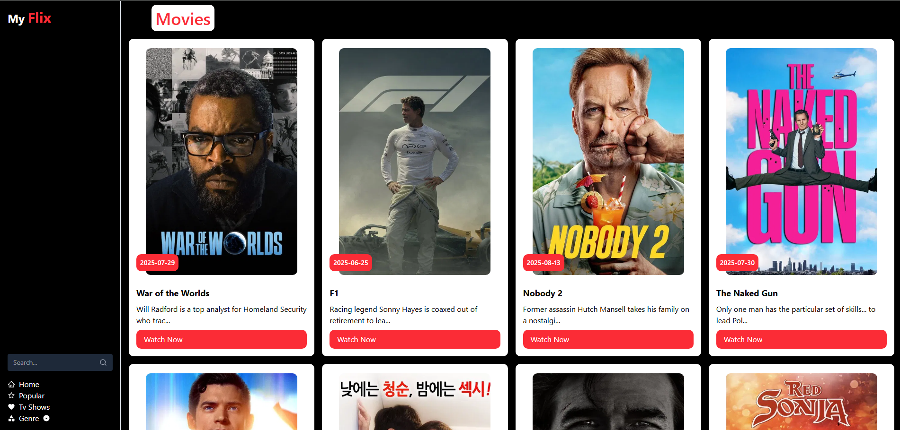
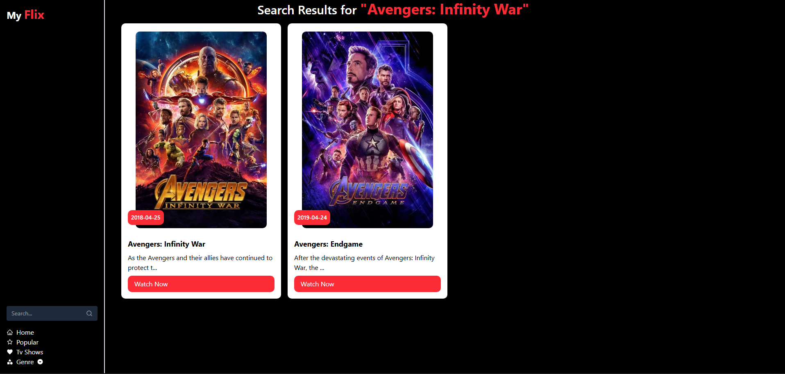
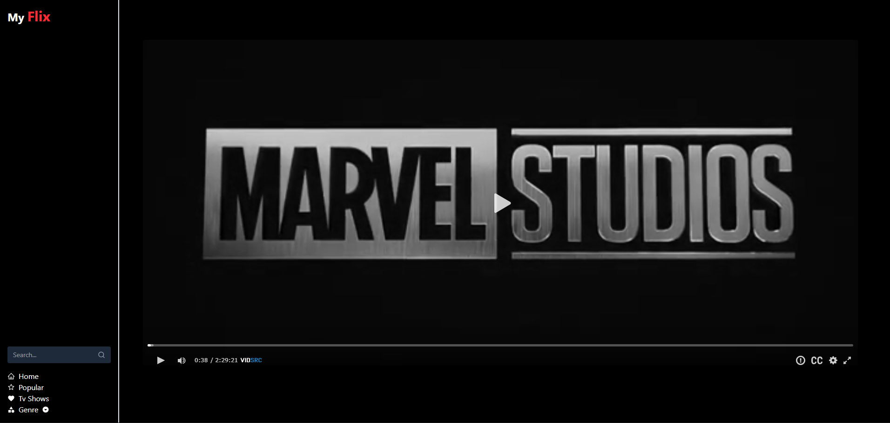
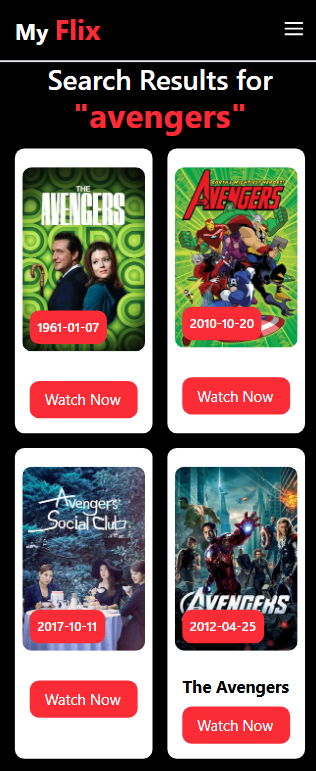

# 🎬 MyFlix - MERN Stack Movie & TV Streaming Platform
## Best app for watching Movies and TV Shows

[](https://opensource.org/licenses/MIT)
[](https://nodejs.org/)
[](https://www.themoviedb.org/)
[](https://reactjs.org/)


> A modern, responsive movie and TV show streaming platform built with the MERN stack. Watch thousands of movies and TV shows in high quality with an intuitive, Netflix-inspired interface.



## ✨ Features

### 🎥 Core Features
- **Unlimited Streaming** - Watch movies and TV shows without limits
- **High-Quality Playback** - Support for HD and Full HD streaming
- **Search & Discovery** - Advanced search with filters by genre, year, rating
- **Responsive Design** - Seamless experience across desktop, tablet, and mobile
- **User Profiles** - Personalized watchlists and viewing history
- **Real-time Updates** - Live content updates and notifications

### 🔐 User Management
- Secure user authentication and authorization
- JWT-based session management
- Password encryption with bcrypt
- Profile customization and preferences
- Watchlist and favorites functionality

### 🎨 User Experience
- Modern, Netflix-inspired UI/UX
- Dark/Light theme toggle
- Smooth animations and transitions
- Infinite scroll loading
- Video player with custom controls
- Subtitle support

<!-- ## 🚀 Live Demo

**[🌐 View Live Demo](https://your-demo-url.com)**

*Experience CineStream in action - no signup required for demo!* -->

## 📸 Screenshots

<details>
<summary>🖼️ Click to view screenshots</summary>

### Homepage


### Movie Details


### Search Results


### Movie Player


### Mobile View


</details>

## 🛠️ Tech Stack

### Frontend
- **React.js** - UI library for building interactive interfaces
- **Redux Toolkit** - State management
- **React Router** - Client-side routing
- **Tailwind CSS** - Utility-first CSS framework
- **Framer Motion** - Animation library
- **Axios** - HTTP client for API calls

### Backend
- **Node.js** - JavaScript runtime environment

### Additional Tools
- **Vid Src** - For Playing Videos

## ⚡ Quick Start

### Prerequisites
Make sure you have these installed:
- [Node.js](https://nodejs.org/) (v18 or higher)
- [Git](https://git-scm.com/)

### Installation

1. **Clone the repository**
   ```bash
   git clone https://github.com/malikshehrozali/myflix.git
   cd cinestream-mern
   ```

2. **Install dependencies**
   ```bash
   # Install server dependencies
   npm install
   
   # Install client dependencies
   cd client
   npm install
   cd ..
   ```

3. **Environment Setup**
   ```bash
   # Create environment file
   cp .env.example .env
   ```

4. **Start the application**
   ```bash
   # Development mode (both client and server)
   npm run dev
   
   # Or start separately
   npm run server    # Backend only
   npm run client    # Frontend only
   ```

5. **Open your browser**
   Navigate to `http://localhost:5173`


## 🔧 Configuration
### API Keys Setup
- **TMDB API**: Get your API key from [The Movie Database](https://www.themoviedb.org/settings/api)
- **Vidsrc**: Sign up at [VidSrc](https://vidsrc.xyz/) for image/video management

## 🚀 Deployment
- **Vercel** - Perfect for frontend deployment
- **Railway** - Great alternative to Heroku
- **DigitalOcean** - VPS deployment
- **AWS/GCP** - Cloud platform deployment

## 🤝 Contributing

We welcome contributions! Please follow these steps:

1. **Fork the repository**
2. **Create a feature branch**
   ```bash
   git checkout -b feature/AmazingFeature
   ```
3. **Commit your changes**
   ```bash
   git commit -m 'Add some AmazingFeature'
   ```
4. **Push to the branch**
   ```bash
   git push origin feature/AmazingFeature
   ```
5. **Open a Pull Request**

### Development Guidelines
- Follow ESLint configuration
- Write meaningful commit messages
- Add tests for new features
- Update documentation as needed

## 📋 API Documentation


### Movie Endpoints
```
GET    /movies          # Get all movies
GET    /movies/:id      # Get movie by ID
GET    /movies/search   # Search movies
```

## 🐛 Known Issues & Roadmap

### Known Issues
- [ ] Video loading optimization needed for slower connections
- [ ] iOS Safari fullscreen video issues

### Roadmap
- [ ] **Mobile Apps** - React Native versions
- [ ] **Offline Mode** - Download content for offline viewing
- [ ] **Social Features** - User reviews and ratings
- [ ] **Recommendation Engine** - AI-powered content suggestions
- [ ] **Live Streaming** - Support for live TV channels
- [ ] **Multi-language Support** - Internationalization


## 📄 License

This project is licensed under the MIT License - see the [LICENSE](LICENSE) file for details.

## 👤 Author

**Malik Shehroz Ali**
- GitHub: [@malikshehrozali](https://github.com/malikshehrozali)
- LinkedIn: [Malik Shehroz Ali](https://www.linkedin.com/in/malikshehrozali)
- Email: malikshehrozali16@gmail.com
- Portfolio: [My Website](https://malikshehrozali.webflow.io)

## 🙏 Acknowledgments

- [The Movie Database (TMDB)](https://www.themoviedb.org/) for movie data API
- [React](https://reactjs.org/) team for the amazing framework
- All contributors and open-source libraries used

## ⭐ Show Your Support

If you found this project helpful, please give it a ⭐ on GitHub and share it with others!

## 📞 Support

Having trouble? Here are some ways to get help:
- 📧 **Email**: malishehrozali16@gmail.com
- 💬 **GitHub Issues**: [Create an issue](https://github.com/malikshehrozali/cinestream-mern/issues)

---

<div align="center">
  <strong>Built with ❤️ using the MERN Stack</strong>
  <br>
  <sub>Make sure to ⭐ this repo if you found it useful!</sub>
</div>
